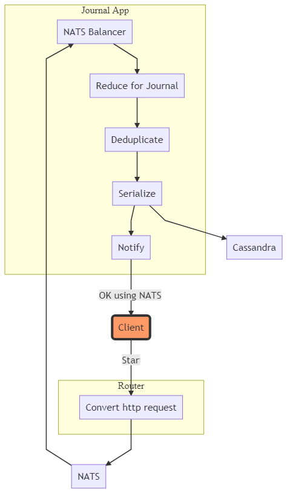
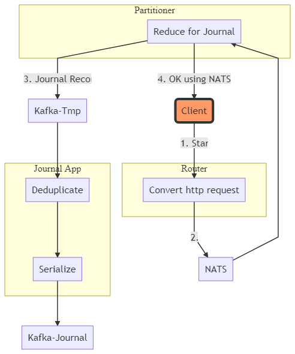

# Using NATS

- Own balancer over NATS is needed
  - Partition = NATS subject
  - Journal Apps need to divide partitions

# Using Kafka

- Separate `Partitioner` is needed since Kafka client can not send an answer
- Reducing can take resources (e.g. loading and working with Avro schemes)
- Jorunal App must use Kafka transactions

# Kafka vs NATS

**NATS**
- No Kafka
- Lesser apps
- Serializer to KV can be used in mobile version

**Kafka**
- No need to implement NATS balancer
- No need to implement  for Aggregators
  - But can be used in mobile version