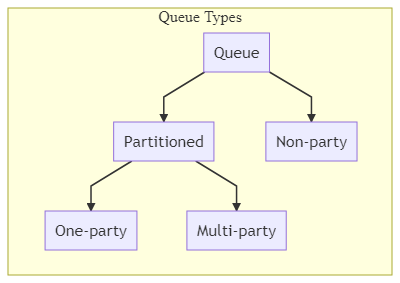
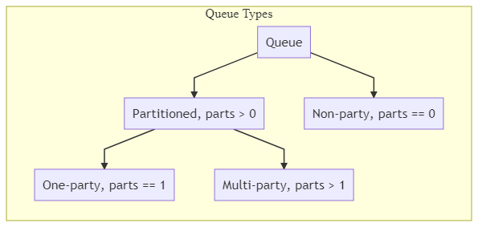

# Introduction

This document describes a way to send modification/view requests to unTill Air cluster

# Site Structure

- /
  - Air Shell
- /api
  - Queues
- /plugins
  - Air Shell plugins

# Queues

- Request always comes to a queue
- Queue types:




Router has to be able to calculate `partition-number` for partitioned queues.

## Calculating Request `partition-number`

- Request has associated `partition-dividend` (e.g. restaurant number)
- Queue has associated `number-of-partitions` 
- `partition-number` = `partition-dividend` % `number-of-partitions` 
  - e.g. `35 = 635 % 100`
  - In other words `partition-number` is a remainder after `partition-dividend` by `number-of-partitions` division



# URL Path Segments

`<proto>://<site>/api/<queue-alias>/<partition-dividend>/<resource-name>/<resource-id>`

All parts are optional

`queue-alias`

- Omitted queue-name means request for list of possible queue aliases
  - Example `curl https://api.github.com`

`partition-dividend` 

- Contains only digits
- For non-party queues is not analyzed, everything after queue-alias passed to handler

`resource-name`

- The first character in `resource-name` must be an alphabet
- Missed `resource-name` means `help` request
- `help`
  - Without  `resource-id` returns list of resources
  - With `resource-id` describes given resource
- if resource becomes incompatible with previous version its name must be changed, say
  - `air.untill.com/api/air-bo/678/articles.v2`
  - `air.untill.com/api/air-bo/678/articles2`

# Requests Examples

## Configuring BO

  - New/Edit article: `POST air.untill.com/api/airs-bp/678/conf`
    - ID is always passsed as a part of body
    - Negative ID means `insert` operation
    - Request
       
        ```json
        {
          "operations": [    
           {
              "id": -1243,
              "type": "sales_area",
              "data": {
                "id_prices": 5000000000001,
                "bmanual": 12,
                "name": "sa",
                "hq_id": "sa",
                "state": 1
              }
           },       
           {
              "id": -1243123,
              "type": "sales_area_exceptions",
              "parent_id": -1243,
              "parent_type": "sales_area",
              "doc_id": -1243,
              "doc_type": "sales_area",
              "data": {
                "id_prices": 5000000000001,
                "id_periods": 5000000000003,
                "id_sales_area": 5000000000005,
                "name": "sae1",
                "hq_id": "sae1",
                "state": 1
              }
            },
            {
              "id": -12431235,
              "type": "sales_area_exceptions",
              "parent_id": -1243,
              "parent_type": "sales_area",
              "doc_id": -1243,
              "doc_type": "sales_area",
              "data": {
                "id_prices": 5000000000001,
                "id_periods": 5000000000003,
                "id_sales_area": 5000000000005,
                "name": "sae2",
                "hq_id": "sae2",
                "state": 1
              }
            }
          ]
        }
        ```
        
    - Response returns map userID (negative value) -> serverID
    
        ```json
        {
          "-1243": 1,
          "-1243123": 2,
          "-12431235": 3
        }   
        ```
        
  - Add POS operation: `POST air.untill.com/api/airs-bp/678/ops`
    - Request
       
        (part of real pbill for demonstration)
        ```json
        {
          "type": "pbill",
          "data": {
            "id": 0,
            "id_bill": 1,
            "id_untill_users": 2,
            "number": 3,
            "failurednumber": 4,
            "suffix": "str5",
            "pdatetime": "str6",
            "id_sales_area": 7,
            "pcname": "str8",
            "service_charge": 9,
            "real_datetime": "str10",
            "tips": 11
           }
         }
        ```
        
    - Response
    
        "ok"
        
  - Special operation: `POST air.untill.com/api/airs-bp/678/<operation>`

## Viewing BO

  - Request `POST /api/airs-bp-view/collection/articles`

    ```json
    {"wsid":[2],"show_deleted":1,"page":1,"page_size":20}
    ```

  - Response view in json with `articles`, `classifiers` and `total` size of `articles` 
    
## Viewing Journal

  - Request `POST /api/airs-bp-view/journal`
    
    ```json
    {"wsid":2,"table_names":["articles", "category"],"last_offset": 5}
    ```
    
  - Response journal
    
## Viewing State

  - Request `POST /api/airs-bp-view/state`

    ```json
    {"wsid":2,"table_names":["articles", "category"]}
    ```
    
  - Response state in `json`
    
## Available Modules

- Get list of available module manifests
  - `POST air.untill.com/api/modules/manifest`

# Links

- https://www.moesif.com/blog/technical/api-design/REST-API-Design-Filtering-Sorting-and-Pagination
  - `?filters[date][gte]=2018-04-01&filters[date][lte]=2018-04-31&filters[status][eq]=active`
- https://restfulapi.net/resource-naming/
  - Do not use underscores ( _ )
- https://restdb.io/docs/querying-with-the-api
- https://en.wikipedia.org/wiki/Representational_state_transfer
