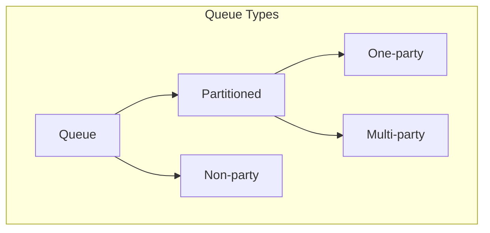
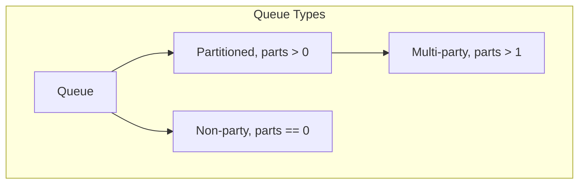
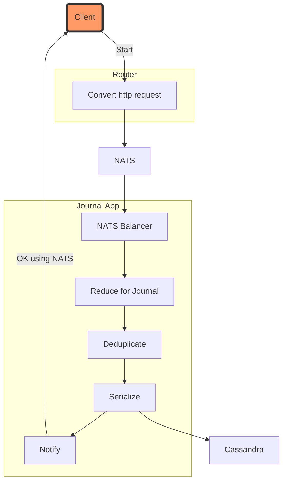
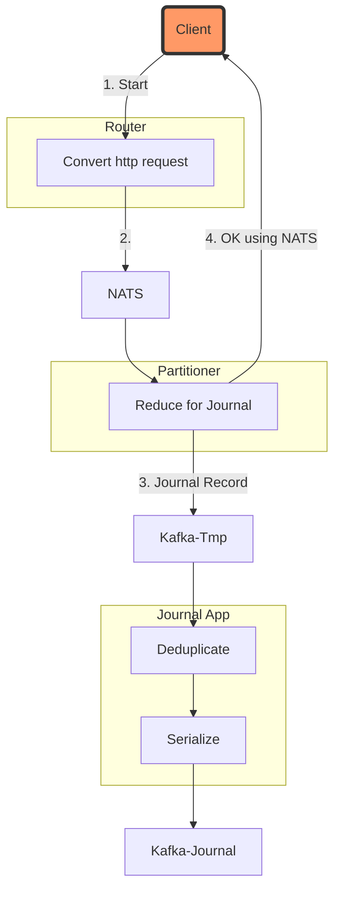

# Queue Types

```mermaid z-charts-queue-types.png
graph TB
    subgraph "Queue Types"
    Queue-->Partitioned
    Queue-->Anarchy[Non-party]
    Partitioned-->One-party
    Partitioned-->Multi-party
    end
```
# Queue Types Ex

```mermaid z-charts-queue-types-ex.png
graph TB
    subgraph "Queue Types"
    Queue-->Partitioned[Partitioned, parts > 0]
    Queue-->Non-party[Non-party, parts == 0]
    Partitioned-->Multi-party[Multi-party, parts > 1]
    end
```

# NATS

```mermaid z-charts-NATS.png
graph TB

    Client(Client)
    HttpHandler[Convert http request]
    Queue[NATS]
    Journal[Cassandra]
    Deduplicator[Deduplicate]
    Reducer[Reduce for Journal]
    Serializer[Serialize]
    Notify[Notify]
    NATSBalancer[NATS Balancer]

    Client-->|Start|HttpHandler

    subgraph Router
      HttpHandler
    end

    HttpHandler-->Queue
    Queue-->NATSBalancer

    subgraph "Journal App"
      NATSBalancer-->Reducer
      Reducer-->Deduplicator
      Deduplicator-->Serializer
      Notify
    end

    Serializer-->Notify
    Serializer-->Journal
    Notify-->|OK using NATS|Client

    classDef start fill:#f96,stroke:#333,stroke-width:4px;
    class Client start 

```

# Kafka

```mermaid z-charts-Kafka.png
graph TB

    Client(Client)
    HttpHandler[Convert http request]
    Reducer[Reduce for Journal]    
    Queue[Kafka-Tmp]
    Journal[Kafka-Journal]
    Deduplicator[Deduplicate]
    Serializer[Serialize]
    NATS[NATS]

    Client-->|1. Start|HttpHandler

    subgraph Router
      HttpHandler
    end

    HttpHandler-->|2.|NATS
    NATS-->Reducer

    subgraph Partitioner
      Reducer
    end

    Reducer-->|4. OK using NATS|Client
    Reducer-->|3. Journal Record|Queue

    Queue-->Deduplicator

    subgraph "Journal App"
      Deduplicator
      Serializer
    end

    Deduplicator-->Serializer
    Serializer-->Journal

    classDef start fill:#f96,stroke:#333,stroke-width:4px;
    class Client start 

```
